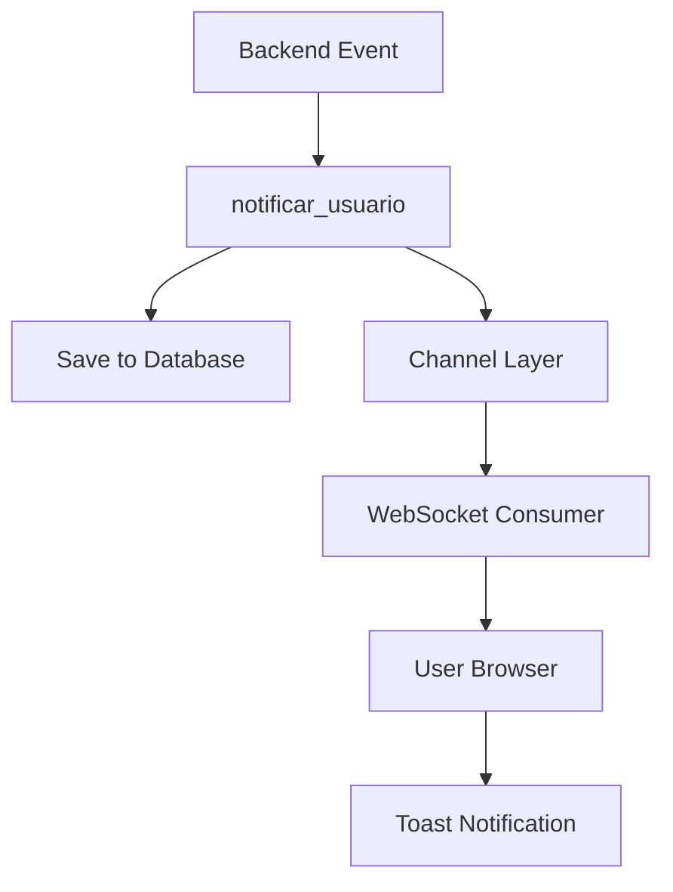

## Overview

Bar Galileo implements a real-time notification system using **Django Channels** and **WebSockets**. This architecture allows the backend to push instant notifications to authenticated users without polling, creating a responsive and modern user experience.

<Note>
Notifications are persisted in the database and displayed as floating pop-ups in the browser, ensuring users never miss important events.
</Note>

## Architecture

The notification system consists of several interconnected components:



### Components

| Component | Purpose | Location |
|-----------|---------|----------|
| `models.py` | Database model for persisting notifications | `notifications/models.py` |
| `consumers.py` | WebSocket consumer handling connections | `notifications/consumers.py` |
| `utils.py` | Helper function to send notifications | `notifications/utils.py` |
| `views.py` | REST API for notification history | `notifications/views.py` |
| `routing.py` | WebSocket URL routing | `notifications/routing.py` |

## Configuration

<Steps>

### Install Django Channels

```bash
pip install channels
```

### Configure settings.py

Add Channels to your installed apps and configure the ASGI application:

```python bar_galileo/settings.py
INSTALLED_APPS = [
    # ...
    'channels',
    'notifications',
]

# ASGI application for WebSocket support
ASGI_APPLICATION = 'bar_galileo.asgi.application'

# Channel layer configuration
CHANNEL_LAYERS = {
    "default": {
        "BACKEND": "channels.layers.InMemoryChannelLayer",
        # For production, use Redis:
        # "BACKEND": "channels_redis.core.RedisChannelLayer",
        # "CONFIG": {"hosts": [("127.0.0.1", 6379)]},
    }
}
```

<Warning>
`InMemoryChannelLayer` is suitable for development only. For production deployments, use Redis-backed channel layers for proper scaling and reliability.
</Warning>

### Configure ASGI routing

Update your `asgi.py` to include WebSocket routing:

```python bar_galileo/asgi.py
import os
from django.core.asgi import get_asgi_application
from channels.routing import ProtocolTypeRouter, URLRouter
from channels.auth import AuthMiddlewareStack
import notifications.routing

os.environ.setdefault("DJANGO_SETTINGS_MODULE", "bar_galileo.settings")

application = ProtocolTypeRouter({
    "http": get_asgi_application(),
    "websocket": AuthMiddlewareStack(
        URLRouter(
            notifications.routing.websocket_urlpatterns
        )
    ),
})
```

### Run database migrations

```bash
python manage.py makemigrations notifications
python manage.py migrate
```

</Steps>

## Database Model

Notifications are stored using a simple but effective schema:

```python notifications/models.py
from django.db import models
from django.contrib.auth.models import User

class Notificacion(models.Model):
    usuario = models.ForeignKey(
        User, 
        on_delete=models.CASCADE, 
        related_name="notificaciones"
    )
    mensaje = models.TextField()
    leida = models.BooleanField(default=False)
    fecha = models.DateTimeField(auto_now_add=True)

    def __str__(self):
        return f"{self.usuario.username} - {self.mensaje}"
```

### Fields

- **usuario**: Foreign key to the User model (notification recipient)
- **mensaje**: Text content of the notification
- **leida**: Boolean flag indicating if the notification has been read
- **fecha**: Automatic timestamp when notification was created

## Sending Notifications

### Basic Usage

The `notificar_usuario()` utility function provides a simple interface for sending notifications:

```python
from notifications.utils import notificar_usuario

# Send notification to current user
notificar_usuario(request.user, "Your order has been confirmed!")
```

### Implementation

The utility function handles both database persistence and real-time delivery:

```python notifications/utils.py
from .models import Notificacion
from channels.layers import get_channel_layer
from asgiref.sync import async_to_sync

def notificar_usuario(usuario, mensaje):
    # 1. Save to database
    Notificacion.objects.create(usuario=usuario, mensaje=mensaje)

    # 2. Send via WebSocket to user's channel group
    channel_layer = get_channel_layer()
    async_to_sync(channel_layer.group_send)(
        f"user_{usuario.id}",
        {
            "type": "enviar_mensaje",
            "message": mensaje
        }
    )
```

### Common Use Cases

<CodeGroup>

```python Order Created
from notifications.utils import notificar_usuario

def create_order(request, table_id):
    order = Order.objects.create(
        user=request.user,
        table_id=table_id,
        status='pending'
    )
    
    # Notify user
    notificar_usuario(
        request.user,
        f"Pedido #{order.id} creado exitosamente"
    )
    
    # Notify all admins
    admins = User.objects.filter(is_superuser=True)
    for admin in admins:
        notificar_usuario(
            admin,
            f"Nuevo pedido #{order.id} en Mesa {table_id}"
        )
```

```python Expense Approved
from notifications.utils import notificar_usuario

def approve_expense(request, expense_id):
    expense = Expense.objects.get(id=expense_id)
    expense.approved = True
    expense.approved_by = request.user
    expense.save()
    
    # Notify expense creator
    notificar_usuario(
        expense.created_by,
        f"Tu gasto '{expense.description}' ha sido aprobado"
    )
```

```python Low Stock Alert
from notifications.utils import notificar_usuario
from django.contrib.auth.models import User

def check_stock_levels():
    low_stock_items = Product.objects.filter(stock__lt=5)
    
    if low_stock_items.exists():
        # Notify inventory managers
        managers = User.objects.filter(
            groups__name='Inventory Managers'
        )
        
        for item in low_stock_items:
            for manager in managers:
                notificar_usuario(
                    manager,
                    f"Stock bajo: {item.stock} unidades de '{item.name}'"
                )
```

</CodeGroup>

## WebSocket Consumer

The consumer handles WebSocket connections and message routing:

```python notifications/consumers.py
import json
from channels.generic.websocket import AsyncWebsocketConsumer

class NotificacionConsumer(AsyncWebsocketConsumer):
    async def connect(self):
        self.user = self.scope["user"]
        
        if self.user.is_authenticated:
            # Join user-specific group
            self.group_name = f"user_{self.user.id}"
            await self.channel_layer.group_add(
                self.group_name, 
                self.channel_name
            )
            await self.accept()
        else:
            await self.close()

    async def disconnect(self, close_code):
        if self.user.is_authenticated:
            await self.channel_layer.group_discard(
                self.group_name, 
                self.channel_name
            )

    async def enviar_mensaje(self, event):
        # Send message to WebSocket
        await self.send(text_data=json.dumps({
            "message": event["message"]
        }))
```

### Connection Flow

<Steps>

1. **User loads page** → JavaScript establishes WebSocket connection
2. **Authentication check** → Consumer verifies user is authenticated
3. **Group join** → User added to `user_{id}` channel group
4. **Event triggered** → `notificar_usuario()` called from backend
5. **Message sent** → Channel layer routes to user's WebSocket
6. **Display notification** → Frontend shows toast/pop-up

</Steps>

## REST API Endpoints

### Get Notification History

```http
GET /api/notifications/history/
```

Returns unread notifications plus the 2 most recent read notifications.

**Response:**
```json
{
  "unread_count": 3,
  "history": [
    {
      "id": 1,
      "mensaje": "Pedido #123 completado",
      "leida": false,
      "fecha": "2026-03-06T10:30:00Z"
    }
  ]
}
```

### Mark as Read

```http
POST /api/notifications/mark-as-read/
Content-Type: application/json

{
  "ids": [1, 2, 3]  // Empty array marks all as read
}
```

### Get Pending Notifications

```http
GET /api/notificaciones/pendientes/
```

Retrieves all unread notifications and automatically marks them as read.

## Frontend Integration

### HTML Setup

Add the notification container to your base template:

```html templates/base.html
<!-- Floating notification container -->
<div id="notificaciones-flotantes"
     style="position: fixed; top: 20px; right: 20px; z-index: 9999;">
</div>

<!-- Include notification scripts -->
<script src=""></script>
```

### JavaScript WebSocket Connection

```javascript static/js/notifications/notifications.js
const protocol = window.location.protocol === 'https:' ? 'wss:' : 'ws:';
const wsUrl = `${protocol}//${window.location.host}/ws/notificaciones/`;

const socket = new WebSocket(wsUrl);

socket.onopen = function() {
    console.log('WebSocket connected');
};

socket.onmessage = function(event) {
    const data = JSON.parse(event.data);
    showNotification(data.message);
};

socket.onerror = function(error) {
    console.error('WebSocket error:', error);
};

function showNotification(message) {
    const container = document.getElementById('notificaciones-flotantes');
    const notification = document.createElement('div');
    notification.className = 'notification toast';
    notification.innerHTML = `
        <div class="alert alert-info alert-dismissible fade show">
            ${message}
            <button type="button" class="btn-close" data-bs-dismiss="alert"></button>
        </div>
    `;
    container.appendChild(notification);
    
    // Auto-remove after 5 seconds
    setTimeout(() => notification.remove(), 5000);
}
```

## Best Practices

<Accordion title="Keep messages concise and actionable">
  Notifications should be brief and provide clear information about what happened.
  
  **Good examples:**
  - "Pedido #123 completado - Mesa 5"
  - "Stock bajo: 5 unidades de Cerveza Corona"
  - "Nuevo backup creado exitosamente"
  
  **Avoid:**
  - "OK" (too vague)
  - "Has cargado la página" (spam)
  - Long multi-sentence explanations
</Accordion>

<Accordion title="Don't over-notify users">
  Only send notifications for important events that require user attention. Over-notification leads to notification fatigue and users ignoring or disabling them.
</Accordion>

<Accordion title="Never include sensitive data">
  Notifications may be visible on screen or in logs. Avoid including:
  - Passwords or credentials
  - Credit card numbers
  - Personal identification numbers
  - Confidential business data
</Accordion>

<Accordion title="Test notification delivery">
  Always test notifications in both development and production environments:
  
  ```python
  from notifications.utils import notificar_usuario
  from django.contrib.auth.models import User
  
  # Test notification
  user = User.objects.get(username='test_user')
  notificar_usuario(user, "Test notification - please confirm receipt")
  ```
</Accordion>

## Production Deployment

For production environments, replace the in-memory channel layer with Redis:

<Steps>

### Install Redis and channels-redis

```bash
sudo apt-get install redis-server
pip install channels-redis
```

### Update settings.py

```python
CHANNEL_LAYERS = {
    "default": {
        "BACKEND": "channels_redis.core.RedisChannelLayer",
        "CONFIG": {
            "hosts": [("127.0.0.1", 6379)],
            # Optional: add authentication
            # "password": "your-redis-password",
        },
    },
}
```

### Run with Daphne (ASGI server)

```bash
pip install daphne
daphne -b 0.0.0.0 -p 8000 bar_galileo.asgi:application
```

</Steps>

## Troubleshooting

<Warning>
If notifications aren't appearing, check these common issues:
</Warning>

### WebSocket not connecting

1. Verify Channels is installed: `pip list | grep channels`
2. Check `ASGI_APPLICATION` setting in `settings.py`
3. Inspect browser console for connection errors
4. Ensure WebSocket URL matches routing configuration

### Notifications not displayed

1. Confirm `#notificaciones-flotantes` div exists in HTML
2. Verify JavaScript files are loaded (check Network tab)
3. Check browser console for JavaScript errors
4. Test WebSocket connection manually with browser tools

### Notifications not saved to database

1. Run migrations: `python manage.py migrate notifications`
2. Verify user is authenticated
3. Check database logs for constraint violations
4. Confirm `Notificacion` model is registered in admin

### Redis connection errors (production)

```bash
# Test Redis connection
redis-cli ping
# Should return: PONG

# Check Redis logs
sudo tail -f /var/log/redis/redis-server.log
```

## Next Steps

<CardGroup cols={2}>
  <Card title="RAG Chat" icon="message-bot" href="/advanced/rag-chat">
    Learn about document Q&A with RAG
  </Card>
  <Card title="Integrations" icon="plug" href="/advanced/integrations">
    Explore third-party integrations
  </Card>
</CardGroup>