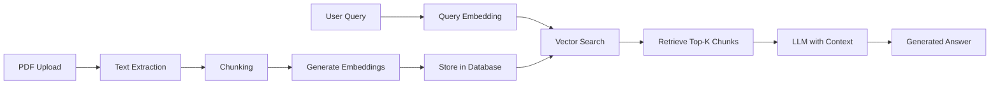

## Overview

The RAG (Retrieval-Augmented Generation) chat system enables users to ask questions about uploaded documents and receive AI-generated answers grounded in the actual document content. This prevents hallucinations and ensures responses are factually accurate based on your source materials.

<Note>
RAG combines semantic search (finding relevant document chunks) with LLM generation (crafting natural language answers) to create an intelligent document assistant.
</Note>

## Architecture



### Key Components

| Component | Technology | Purpose |
|-----------|-----------|----------|
| Document Loader | PyMuPDF (fitz) | Extract text from PDFs |
| Embeddings | sentence-transformers | Convert text to vectors |
| Vector Store | FAISS | Fast similarity search |
| LLM | Google Gemini 2.0 Flash | Generate contextual answers |
| Database | MySQL | Persist documents and chunks |

## Database Models

### DocumentCollection

Stores metadata about uploaded documents:

```python rag_chat/models.py
class DocumentCollection(models.Model):
    user = models.ForeignKey(User, on_delete=models.CASCADE)
    title = models.CharField(max_length=300)
    file = models.FileField(upload_to='rag_documents/')
    file_type = models.CharField(max_length=50, default='pdf')
    page_count = models.IntegerField(default=0)
    chunk_count = models.IntegerField(default=0)
    status = models.CharField(
        max_length=20,
        choices=[
            ('pending', 'Pendiente'),
            ('processing', 'Procesando'),
            ('indexed', 'Indexado'),
            ('error', 'Error'),
        ],
        default='pending'
    )
    error_message = models.TextField(blank=True, null=True)
    created_at = models.DateTimeField(auto_now_add=True)
```

### DocumentChunk

Stores individual text chunks with their vector embeddings:

```python rag_chat/models.py
class DocumentChunk(models.Model):
    collection = models.ForeignKey(
        DocumentCollection,
        on_delete=models.CASCADE,
        related_name='chunks'
    )
    chunk_index = models.IntegerField()
    content = models.TextField()
    embedding = models.JSONField(
        help_text='Vector embedding (list of floats)',
        default=list
    )
    metadata = models.JSONField(
        default=dict,
        help_text='Page numbers, section info, etc.'
    )
    created_at = models.DateTimeField(auto_now_add=True)

    def get_embedding_vector(self):
        """Returns embedding as numpy-compatible list"""
        if isinstance(self.embedding, str):
            return json.loads(self.embedding)
        return self.embedding
```

### RAGQuery

Tracks query history for analytics:

```python rag_chat/models.py
class RAGQuery(models.Model):
    user = models.ForeignKey(User, on_delete=models.CASCADE)
    collection = models.ForeignKey(
        DocumentCollection, 
        on_delete=models.SET_NULL,
        null=True
    )
    query = models.TextField()
    response = models.TextField()
    chunks_used = models.JSONField(default=list)
    created_at = models.DateTimeField(auto_now_add=True)
```

## Installation & Setup

<Steps>

### Install required dependencies

```bash
pip install pymupdf sentence-transformers faiss-cpu requests

# For GPU acceleration (optional)
pip install faiss-gpu

# For OCR support (optional)
pip install pytesseract pillow
sudo apt-get install tesseract-ocr tesseract-ocr-spa
```

### Add to INSTALLED_APPS

```python bar_galileo/settings.py
INSTALLED_APPS = [
    # ...
    'rag_chat',
]
```

### Configure Google API Key

Add your Google Gemini API key to `.env`:

```bash .env
GOOGLE_API_KEY=your_api_key_here
```

<Note>
Get your API key from [Google AI Studio](https://makersuite.google.com/app/apikey)
</Note>

### Run migrations

```bash
python manage.py makemigrations rag_chat
python manage.py migrate
```

### Create media directory

```bash
mkdir -p media/rag_documents
```

</Steps>

## Document Processing Pipeline

### 1. Upload Document

```http
POST /api/rag/upload/
Content-Type: multipart/form-data

file: [PDF file]
title: "User Manual"
```

**Response:**
```json
{
  "collection_id": 1,
  "title": "User Manual",
  "status": "indexed",
  "chunk_count": 45,
  "page_count": 12
}
```

### 2. Text Extraction

The document loader extracts text from each PDF page:

```python rag_chat/document_loader.py
class DocumentLoader:
    def load_pdf(self, file_path: str):
        pages_data = []
        doc = fitz.open(file_path)
        
        for page_num in range(len(doc)):
            page = doc[page_num]
            text = page.get_text()
            
            # Optional: OCR for scanned pages
            if not text.strip() and self.use_ocr:
                text = self._ocr_page(page)
            
            pages_data.append({
                'page': page_num + 1,
                'text': text,
                'metadata': {'page_number': page_num + 1}
            })
        
        return pages_data, len(doc)
```

### 3. Text Chunking

Documents are split into overlapping chunks for better retrieval:

```python rag_chat/document_loader.py
def chunk_text(pages_data, chunk_size=500, overlap=50):
    """
    Splits text into chunks with overlap to preserve context.
    
    Args:
        pages_data: List of page dictionaries
        chunk_size: Approximate words per chunk
        overlap: Overlapping words between chunks
    
    Returns:
        List of chunks with metadata
    """
    chunks = []
    words = full_text.split()
    
    i = 0
    while i < len(words):
        chunk_end = min(i + chunk_size, len(words))
        chunk_text = ' '.join(words[i:chunk_end])
        
        chunks.append({
            'content': chunk_text.strip(),
            'metadata': {
                'chunk_index': len(chunks),
                'source_pages': [page_number],
                'word_count': chunk_end - i
            }
        })
        
        i += chunk_size - overlap  # Overlap for context
    
    return chunks
```

<Warning>
Chunk size and overlap are critical parameters. Too small = loss of context. Too large = poor retrieval precision.
</Warning>

### 4. Generate Embeddings

Text chunks are converted to vector embeddings using sentence-transformers:

```python rag_chat/embeddings.py
class EmbeddingGenerator:
    MODELS = {
        'mini': 'all-MiniLM-L6-v2',  # 384 dimensions, fast
        'multilingual': 'paraphrase-multilingual-MiniLM-L12-v2',  # Spanish support
        'large': 'intfloat/multilingual-e5-base',  # 768 dimensions, best quality
    }
    
    def __init__(self, model_name='multilingual'):
        from sentence_transformers import SentenceTransformer
        self.model = SentenceTransformer(self.MODELS[model_name])
        self.dimension = self.model.get_sentence_embedding_dimension()
    
    def encode_documents(self, texts: list, show_progress=True):
        """Generate embeddings for multiple documents"""
        return self.model.encode(
            texts,
            batch_size=32,
            show_progress_bar=show_progress,
            convert_to_numpy=True
        )
    
    def encode_query(self, query: str):
        """Generate embedding for a single query"""
        return self.encode([query])[0]
```

### 5. Store in Database

Chunks and embeddings are persisted:

```python rag_chat/views.py
def _process_document(collection: DocumentCollection):
    # Load PDF
    loader = DocumentLoader(use_ocr=False)
    pages_data, total_pages = loader.load_pdf(collection.file.path)
    
    # Generate chunks
    chunks = loader.chunk_text(pages_data, chunk_size=500, overlap=50)
    
    # Generate embeddings
    generator = get_embedding_generator()
    texts = [chunk['content'] for chunk in chunks]
    embeddings = generator.encode_documents(texts, show_progress=True)
    
    # Save to database
    for idx, (chunk, embedding) in enumerate(zip(chunks, embeddings)):
        DocumentChunk.objects.create(
            collection=collection,
            chunk_index=idx,
            content=chunk['content'],
            embedding=embedding.tolist(),
            metadata=chunk['metadata']
        )
    
    collection.chunk_count = len(chunks)
    collection.status = 'indexed'
    collection.save()
```

## Querying Documents

### Basic Query

```http
POST /api/rag/query/
Content-Type: application/json

{
  "collection_id": 1,
  "query": "How do I reset my password?",
  "top_k": 3
}
```

**Response:**
```json
{
  "answer": "To reset your password, navigate to the Settings page and click 'Change Password'. Enter your current password followed by your new password twice for confirmation.",
  "sources": [
    {
      "content": "Password Management: Users can change their password from the Settings...",
      "page": [8],
      "similarity": 0.847
    }
  ],
  "collection_title": "User Manual"
}
```

### Query Processing Flow

<Steps>

1. **Embed query** → Convert user's question to vector
2. **Vector search** → Find top-K most similar chunks using FAISS
3. **Build context** → Concatenate retrieved chunks with page numbers
4. **LLM generation** → Send context + query to Google Gemini
5. **Return answer** → Send response with source citations

</Steps>

### Implementation

```python rag_chat/views.py
class QueryRAGView(View):
    def post(self, request):
        data = json.loads(request.body)
        query = data['query']
        collection_id = data['collection_id']
        top_k = data.get('top_k', 3)
        
        # 1. Generate query embedding
        generator = get_embedding_generator()
        query_vector = generator.encode_query(query)
        
        # 2. Search for similar chunks
        vector_store = DatabaseVectorStore(collection_id, generator.get_dimension())
        results = vector_store.search(query_vector, k=top_k)
        
        if not results:
            return JsonResponse({
                'answer': 'No encontré información relevante.',
                'sources': []
            })
        
        # 3. Generate answer with LLM
        answer, error = _call_google_api_with_context(query, results)
        
        if error:
            return JsonResponse({'error': error}, status=500)
        
        # 4. Prepare response with sources
        sources = [
            {
                'content': r['metadata']['content'][:200] + '...',
                'page': r['metadata'].get('source_pages', []),
                'similarity': round(r['similarity'], 3)
            }
            for r in results
        ]
        
        return JsonResponse({
            'answer': answer,
            'sources': sources
        })
```

## Vector Search with FAISS

FAISS (Facebook AI Similarity Search) provides efficient vector similarity search:

```python rag_chat/vector_store.py
class VectorStore:
    def __init__(self, dimension: int):
        import faiss
        # Use L2 distance for cosine similarity (after normalization)
        self.index = faiss.IndexFlatL2(dimension)
        self.metadata = []
    
    def add(self, vectors: np.ndarray, metadata: list):
        """Add vectors to index"""
        vectors = vectors.astype('float32')
        faiss.normalize_L2(vectors)  # Normalize for cosine similarity
        self.index.add(vectors)
        self.metadata.extend(metadata)
    
    def search(self, query_vector: np.ndarray, k: int = 5):
        """Find k most similar vectors"""
        query_vector = query_vector.astype('float32').reshape(1, -1)
        faiss.normalize_L2(query_vector)
        
        distances, indices = self.index.search(query_vector, k)
        
        results = []
        for idx, dist in zip(indices[0], distances[0]):
            results.append({
                'metadata': self.metadata[idx],
                'score': float(dist),
                'similarity': 1 / (1 + float(dist))
            })
        
        return results
```

### Database Vector Store

Hybrid approach: FAISS for search speed + Django ORM for persistence:

```python rag_chat/vector_store.py
class DatabaseVectorStore:
    def __init__(self, collection_id: int, dimension: int):
        self.collection_id = collection_id
        self.vector_store = VectorStore(dimension)
        self._load_from_database()
    
    def _load_from_database(self):
        """Load vectors from Django database into FAISS index"""
        chunks = DocumentChunk.objects.filter(
            collection_id=self.collection_id
        ).order_by('chunk_index')
        
        vectors = []
        metadata = []
        
        for chunk in chunks:
            embedding = chunk.get_embedding_vector()
            vectors.append(embedding)
            metadata.append({
                'chunk_id': chunk.id,
                'content': chunk.content,
                **chunk.metadata
            })
        
        vectors_array = np.array(vectors)
        self.vector_store.add(vectors_array, metadata)
```

## LLM Integration

Google Gemini 2.0 Flash is used for answer generation:

```python rag_chat/views.py
def _call_google_api_with_context(query: str, context_chunks: list):
    """
    Calls Google Gemini with document context.
    
    Args:
        query: User's question
        context_chunks: Retrieved relevant chunks
    
    Returns:
        tuple: (answer, error)
    """
    import requests
    import os
    
    api_key = os.getenv('GOOGLE_API_KEY')
    
    # Build context from retrieved chunks
    context_text = "\n\n".join([
        f"[Página {c['metadata'].get('source_pages', ['?'])[0]}] {c['metadata']['content']}"
        for c in context_chunks
    ])
    
    # Construct prompt
    prompt = f"""Basándote en la siguiente información del manual, responde la pregunta.
Si la respuesta no está en el contexto, indícalo claramente.

CONTEXTO:
{context_text}

PREGUNTA: {query}

RESPUESTA:"""
    
    # Call API
    url = 'https://generativelanguage.googleapis.com/v1beta/models/gemini-2.0-flash:generateContent'
    headers = {
        'Content-Type': 'application/json',
        'X-goog-api-key': api_key
    }
    payload = {
        'contents': [{
            'parts': [{'text': prompt}]
        }]
    }
    
    response = requests.post(url, headers=headers, json=payload, timeout=30)
    
    if response.status_code != 200:
        return None, f'Error API: {response.status_code}'
    
    result = response.json()
    text = result['candidates'][0]['content']['parts'][0]['text']
    
    return text, None
```

## REST API Reference

### Upload Document

```http
POST /api/rag/upload/
Content-Type: multipart/form-data
```

**Parameters:**
- `file`: PDF file (required)
- `title`: Document title (optional, defaults to filename)

### Query RAG

```http
POST /api/rag/query/
Content-Type: application/json
```

**Body:**
```json
{
  "collection_id": 1,
  "query": "Your question here",
  "top_k": 3  // Number of chunks to retrieve
}
```

### List Documents

```http
GET /api/rag/documents/
```

**Response:**
```json
{
  "documents": [
    {
      "id": 1,
      "title": "User Manual",
      "status": "indexed",
      "page_count": 12,
      "chunk_count": 45,
      "created_at": "2026-03-06T10:00:00Z",
      "error": null
    }
  ]
}
```

### Delete Document

```http
DELETE /api/rag/document/<collection_id>/
```

### Query History

```http
GET /api/rag/history/?limit=20
```

## Performance Optimization

### Model Selection

Choose embedding model based on your needs:

| Model | Dimensions | Speed | Quality | Use Case |
|-------|-----------|-------|---------|----------|
| `mini` | 384 | Fast | Good | Quick prototyping |
| `multilingual` | 384 | Fast | Better | Spanish content |
| `large` | 768 | Slower | Best | Production, accuracy critical |

```python
# Configure in code
generator = EmbeddingGenerator(model_name='multilingual')
```

### Chunk Size Tuning

```python
# Smaller chunks = better precision, more chunks
chunks = loader.chunk_text(pages, chunk_size=300, overlap=30)

# Larger chunks = more context, fewer chunks
chunks = loader.chunk_text(pages, chunk_size=800, overlap=100)
```

### FAISS Index Types

For larger datasets, use more efficient indexes:

```python
import faiss

# Small datasets (< 10K vectors)
index = faiss.IndexFlatL2(dimension)

# Medium datasets (10K-1M vectors)
quantizer = faiss.IndexFlatL2(dimension)
index = faiss.IndexIVFFlat(quantizer, dimension, 100)  # 100 clusters

# Large datasets (> 1M vectors)
index = faiss.IndexIVFPQ(quantizer, dimension, 100, 8, 8)
```

## Best Practices

<Accordion title="Pre-process documents before upload">
  Clean and format documents for better extraction:
  - Remove headers/footers
  - Fix OCR errors
  - Ensure consistent formatting
  - Split large documents into logical sections
</Accordion>

<Accordion title="Tune retrieval parameters">
  Experiment with `top_k` values:
  - Too low (1-2): May miss relevant context
  - Too high (10+): Adds noise, slower LLM processing
  - Sweet spot: 3-5 chunks for most use cases
</Accordion>

<Accordion title="Monitor query quality">
  Track metrics:
  - Average similarity scores
  - User feedback on answers
  - Questions with no relevant chunks found
  - LLM response times
</Accordion>

<Accordion title="Handle multilingual content">
  Use multilingual embedding models:
  ```python
  generator = EmbeddingGenerator(model_name='multilingual')
  ```
  This ensures Spanish, English, and other languages are properly understood.
</Accordion>

## Troubleshooting

### High memory usage

- Reduce batch size in embeddings: `generator.encode(texts, batch_size=16)`
- Use smaller embedding models
- Process documents in batches

### Slow query responses

- Reduce `top_k` parameter
- Use faster embedding model
- Implement result caching

### Poor answer quality

- Increase `top_k` to provide more context
- Improve document chunking strategy
- Use larger/better embedding model
- Refine LLM prompt template

### OCR errors

```bash
# Install Tesseract with Spanish language pack
sudo apt-get install tesseract-ocr-spa

# Enable OCR in loader
loader = DocumentLoader(use_ocr=True)
```

## Next Steps

<CardGroup cols={2}>
  <Card title="Notifications" icon="bell" href="/advanced/notifications">
    Implement real-time WebSocket notifications
  </Card>
  <Card title="Integrations" icon="plug" href="/advanced/integrations">
    Connect with external services
  </Card>
</CardGroup>